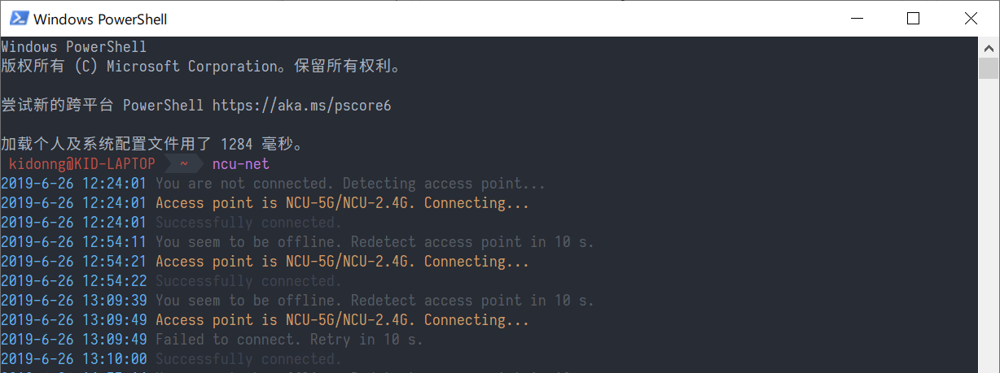

<h1 align="center">📶 NCU Net</h1>

<div align="center">

[](https://npm.im/ncu-net)

[](./LICENSE)

English | [简体中文](README-zh-CN.md)

</div>

NCU Net is a command line client for _NCU Campus Network Access Authentication System_. Supports both `NCU-5G/NCU-2.4G` and `NCUWLAN`.



## Install

- npm: `npm i -g ncu-net`
- Yarn: `yarn global add ncu-net`
- Packages for Windows, Linux & macOS: [Releases](../../releases)

> There is an [user script version](https://github.com/kidonng/cherry/tree/master/scripts#ncu-net) as well.

## Features

- No more manual authentication
- Auto detect access point type
- Auto reconnect
- Concise & colorful messages and logs

## Usage

If no option is provided, NCU Net will make a connection.

```
> ncu-net -h
Usage: ncu-net [options]

Options:
  -x, --ncuxg <account>    Config NCU-5G/NCU-2.4G account
  -w, --ncuwlan <account>  Config NCUWLAN account
  -t, --timing <config>    Config check interval & retry timeout
  -c, --config [file]      View config or load config from provided JSON file
  -V, --version            output the version number
  -h, --help               output usage information
```

**Notes:**

- **Parameters are splited by commas (`,`) and should be provided in order.**
- NCU-5G/NCU-2.4G account contains **username**, **ISP** (`cmcc`, `unicom`, `ndcard` or `ncu`) and **password**.
- NCUWLAN account contains **username** and **password**.
- Timing config contains **check interval** and **retry timeout** (in milliseconds).
  - We recommend setting retry timeout to set no less than 10 seconds, because NCUWLAN needs a 10 seconds break between two logins.

You may want to set up a daemon via a process manager (e.g. [pm2](https://github.com/Unitech/pm2)).

## Development

- Setup `yarn`
- Run `node index`

## Related

- [ncuwlan](https://github.com/maoyuqing/ncuwlan)
